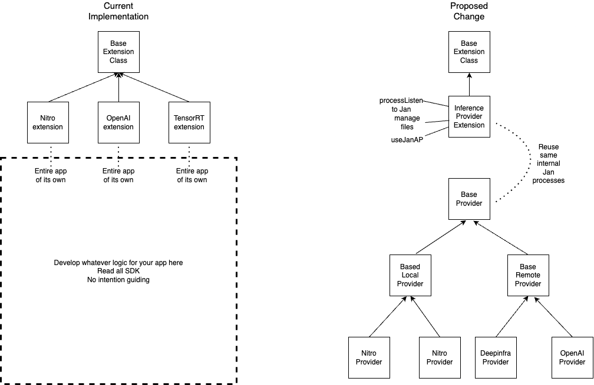

# ADR #001:Revamp Inference Extension

## Authors

@tikikun

## Legend

TBD

## Context

### Status Quo

The current approach to different inference providers are shown with the 3 extensions below
- https://github.com/janhq/jan/tree/dev/extensions/inference-nitro-extension
- https://github.com/janhq/jan/blob/dev/extensions/inference-openai-extension
- https://github.com/janhq/jan/tree/dev/extensions/inference-triton-trtllm-extension

Main technical concerns:

- The way these inference extensions are coded are defying the way how most of the extension framework, or, as in Jan framework case, work.
  - Extension of how it was abtrated in Jan framework is a standalone application
  - Extension should handle more cases due to above nature rather than solve single use-case
  - Extension itself can be reused and add more functionalities (add more providers of inference, re-solve both local and remote cases)
- Ultilities must come from framework level (core), not coming from copy code files all over
- Code duplication

Main SDK/devrel concerns:
- We must have different layers of contributing.
  - For example if you are coming from Deepinfra and want to connect Jan to the Deepinfre. You only need to write or add a simple adapter or config to main inference extension, not rewrite the entire extension which is in itself a standalone app
  - Should cater for developer audience: Core/App contributor, Third-party provider (eg above), Inference engine provider. The current approach is, everyone is an extension developer.

### Consideration

What was changed?

Current state:
- A provider needs to read through the entire JanSDK (supposedly it is in existence) documentation and understand all the onLoad(),... internal logic of Jan to be able to add a mere provider that most of the time is either OpenAI compatible,....
- A provider needs to maintain their own inference logic without any help from the official framework asides from the internal logic (which if you are a third party provider you might not care about).
- A provider is not guided to any particular interface or coding style that is compatible or suitable for how Jan operate, but mostly decide on their own.

Propsed change:
- Introduce `providerBase` as a base class and subsequent base classes for `localProviderBase` and `remoteProviderBase` to give some guidance over how you can implement a provider.
- All the internal logics can be centralized and handled by one single extension `InferenceProviderExtension`, cut down requirements (as in current state above) to add a new provider.
- Some popular provider can be subsequently inherit or extends to support `OpenAI compatible` that has similiar interface.
- Development effort will be focused on how to deliver your provider, which is around the logic of inferencing that the developer implementing it already quite familiar.

Overall idea: Moving from high requirements, high freedom -> Structured, easier to implement 

## Decision

TBD

## Detailed Design

TBD
